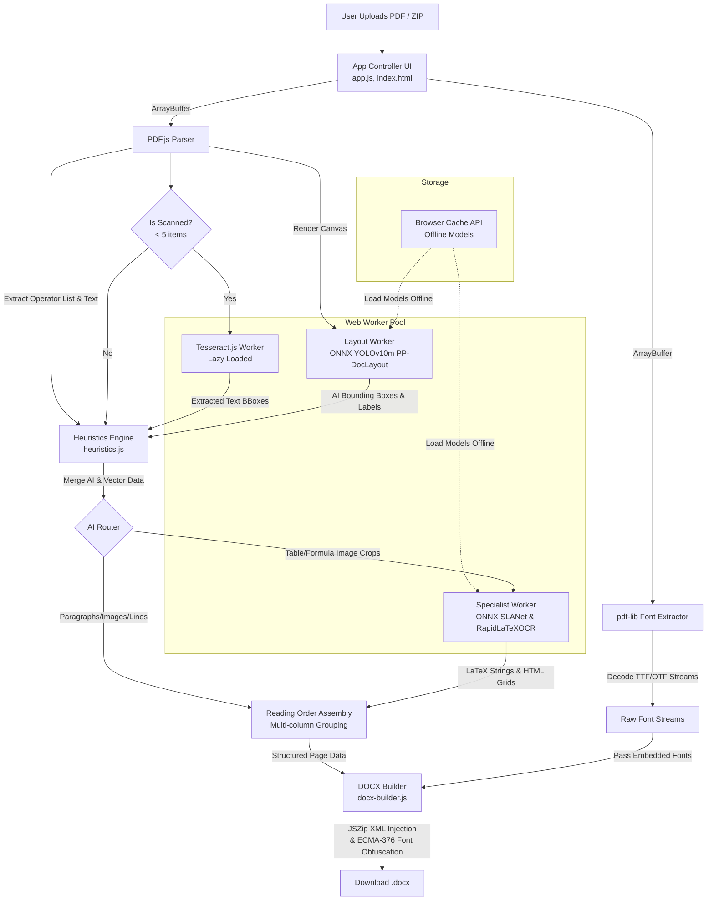

# Architecture & Data Flow

**pdf2docx-serverless** is engineered to execute heavy, multi-stage document processing entirely on the client-side. Built for the Youth Code x AI hackathon, this project uses vanilla HTML, CSS, and JavaScript without relying on a backend server.

To achieve this without freezing the browser's UI or compromising user privacy, the architecture relies on a highly concurrent Web Worker pool, WebAssembly (WASM) accelerated ONNX inference, and deep binary manipulation of both PDF and DOCX file structures.

## Data Flow Diagram

## Core Components Deep Dive

The application is broken down into modular, purpose-built vanilla JS files that orchestrate the pipeline from raw PDF bytes to a formatted Word document.

### 1. Orchestration & State Management (`app.js` & `index.html`)

The `app.js` file acts as the central brain of the application. It manages the UI state, hardware profiling, and the asynchronous conversion queue.

* **Hardware Profiling & Concurrency:** It detects the user's CPU cores (`navigator.hardwareConcurrency`) and RAM (`navigator.deviceMemory`) to dynamically scale a `LayoutWorkerPool` and a `PageTaskQueue`. This allows multi-page PDFs to be processed in parallel across available cores without blocking the main thread.
* **ZIP & Batch Processing:** Uses `JSZip` to unpack uploaded `.zip` archives client-side, extracting PDFs and adding them to the processing queue automatically.
* **Fallback OCR:** If a page is detected as a "scanned document" (containing fewer than 5 spatial text items), it lazily loads a `Tesseract.js` worker to run optical character recognition and extract text bounding boxes before continuing the pipeline.

### 2. Deep Font Extraction (`app.js` via `pdf-lib`)

To ensure the resulting Word document looks exactly like the PDF, the fonts must be preserved.

* **Binary Parsing:** Before rendering, the app uses `pdf-lib` to parse the PDF's internal object tree. It searches for `FontFile2` (TrueType) and `FontFile3` (OpenType/CFF) streams embedded within the document.
* **Stream Decoding:** It decodes these raw binary streams and passes them down the pipeline as `Uint8Array` buffers, tracking the original font names and metadata (like the OS/2 PANOSE tables used for font metrics).

### 3. AI Layout Engine (`layout-worker.js`)

Running on a background Web Worker, this file manages the primary AI vision model for document understanding.

* **ONNX Runtime Web:** Uses `onnxruntime-web` compiled to WebAssembly (WASM) to run machine learning models directly in the browser at near-native speeds.
* **Offline Caching:** The YOLOv10m PP-DocLayout model (~50MB) is downloaded once and stored in the browser's `Cache API`. Subsequent loads skip the network entirely, enabling offline use.
* **Inference Pipeline:** The PDF page is rendered to a canvas, resized blindly to an 800x800 tensor, normalized, and fed into the model.
* **Post-processing:** The model outputs bounding boxes for 25 different layout classes (e.g., text, title, header, footer, table, formula). A greedy Non-Maximum Suppression (NMS) algorithm filters out overlapping detections based on an Intersection over Union (IoU) threshold.

### 4. Heuristics & Style Engine (`heuristics.js`)

The most mathematically complex part of the pipeline. While AI draws bounding boxes, the heuristics engine determines *what* exact text, font, color, and vector shapes exist inside those boxes.

* **Operator List Analysis:** Intercepts `pdf.js` drawing operations (`getOperatorList`). It parses vector commands (lines, rectangles, curves) and fill colors to identify horizontal rules, vertical borders, page backgrounds, and underlines.
* **Style Extraction:** Extracts exact font family, size, weight, and italic slant. If the PDF uses vector shapes to obscure text color, the engine falls back to a Canvas pixel-sampling algorithm to extract the true RGB color of the text.
* **AI + Heuristic Merging (Reclassification):** Cross-references AI bounding boxes with heuristic vector data. For example, if the AI detects an "image", but the heuristics engine sees a dense grid of horizontal/vertical drawn vector lines in that same area, it dynamically reclassifies the "image" as a "chart".
* **Text Grouping & Columns:** Groups individual characters into lines using Y-axis tolerances. It groups lines into paragraphs and uses a binned X-histogram to detect vertical gaps in the text, grouping elements into `column_block` structures for accurate multi-column layout recreation.

### 5. Specialized AI Routing (`specialist-worker.js`)

When `heuristics.js` identifies a highly complex element, it crops that region from the canvas as raw `ImageData` and routes it to specialized AI models.

* **Table Structure Recognition (SLANet):** Uses the `PP-StructureV2` model. The model outputs HTML-like tokens (e.g., `<tr>`, `<td colspan="2">`). The worker parses these tokens into a mathematical grid, clustering X and Y coordinates to establish robust table rows, columns, and cell spans.
* **Formula Recognition (RapidLaTeXOCR):** Takes cropped images of mathematical equations and runs them through a dual encoder-decoder ONNX pipeline to generate raw LaTeX strings.

### 6. DOCX Assembly & Font Injection (`docx-builder.js`)

Translates the structured JSON page data generated by the pipeline into a valid Office Open XML (`.docx`) file.

* **Formatting Translation:** Maps heuristic alignments, indents, bullet points, and tab stops to native `docx` properties. It calculates exact line spacing in *twips* (twentieth of a point) based on actual font metrics to ensure the layout matches the PDF perfectly.
* **Layout Recreation:** Renders images as floating/inline elements, formulas as italicized text, tables as native DOCX tables, and multi-column layouts as borderless tables (a standard DOCX trick for precise column control).
* **ECMA-376 Font Obfuscation:** Microsoft Word strictly requires embedded fonts to be obfuscated. The builder uses `JSZip` to:
  1. Generate a UUID for the font (`fontKey`).
  2. Create a 32-byte obfuscation key by reversing the UUID bytes.
  3. XOR the first 32 bytes of the raw TTF/OTF font stream (extracted in Step 2).
  4. Save the obfuscated font as an `.odttf` file inside the ZIP structure (`word/fonts/`).
  5. Inject the necessary XML nodes into `[Content_Types].xml`, `fontTable.xml`, and `.rels` files so Microsoft Word recognizes, validates, and natively loads the local fonts.